# 事件抽取调研——学术界

##  目录

- [ 事件抽取调研——学术界](#head1)
	- [ 目录](#head2)
	- [1. 任务](#head3)
		- [1.1. 任务定义](#head4)
			- [1.1.1. 封闭域事件抽取](#head5)
			- [1.1.2. 开放域事件抽取](#head6)
		- [1.2. 数据集](#head7)
			- [1.2.1 Sentence-level](#head8)
			- [1.2.2 Document-level](#head9)
		- [1.3. 评测标准](#head10)
	- [2. 方法总结](#head11)
		- [2.1. 基于模板匹配的方法](#head12)
			- [ 示例：](#head13)
		- [2.2. 监督学习](#head14)
			- [2.2.1. 机器学习](#head15)
				- [2.2.1.1. 模型的文本特征](#head16)
				- [2.2.1.2. Pipeline（流水线模型）](#head17)
				- [2.2.1.3. Joint（联合模型）](#head18)
			- [2.2.2. 深度学习](#head19)
				- [2.2.2.1 CNN](#head20)
				- [2.2.2.2 RNN(recurrent neural network)](#head21)
				- [2.2.2.4 基于注意力机制的模型](#head22)
				- [2.2.2.5 基于Transformer的模型](#head23)
					- [ TextToEvent：](#head24)
	- [ 3.特殊事件抽取场景](#head25)
		- [3.1 Document-level事件抽取:](#head26)
		- [3.2 Few-Shot/Zero-Shot：](#head27)
	- [ 4.参考文献](#head28)

## 1. 任务

### 1.1. 任务定义

事件抽取是把含有事件信息的非结构化文本以结构化的形式呈现出来的一类信息抽取的任务

#### 1.1.1. 封闭域事件抽取

封闭域事件抽取使用预定义的事件模式从文本中发现和提取所需的特定类型的事件。事件模式包含多个事件类型及其相应的事件结构。

封闭域的事件被分为事件提及，事件触发词，事件论元，论元角色四个部分。

- 事件提及：描述事件信息的短语或者句子。
- 事件触发词：标志某一事件的发生，一般为动词。
- 事件论元：用于描述一个事件的时间、地点、人物等重要信息。
- 论元角色：论元与它所参与的事件之间的关系。

D.Ahn首先提出将ACE事件抽取任务分成四个子任务:触发词检测、事件/触发词类型识别、事件论元检测和参数角色识别。

#### 1.1.2. 开放域事件抽取

在没有预定义事件模式的情况下，开放域事件提取旨在从文本中检测事件，并且在大多数情况下，还通过提取的事件关键字对相似事件进行聚类。事件关键字是指主要描述事件的那些词/短语，有时关键字进一步分为触发器和论元。

TDT 公共评估计划（The TDT public evaluation program）将故事（story）定义为描述特定事件的新闻文章片段，将主题（topic）定义为文章中的一组事件，且与某些现实世界的主题密切相关。基于这些定义，它定义了以下任务：

- 故事分割：从新闻文章中检测故事的边界。
- 首故事检测：检测在新闻流中讨论新主题的故事。
- 主题检测：根据故事的主题对进行分组。
- 主题跟踪：检测先前已知主题的故事。
- 故事链接检测：确定一对故事是否讨论同一主题。

### 1.2. 数据集

##### 1.2.1 Sentence-level

- **ACE 2005**

  **数据集简介**：ACE2005语料库是语言数据联盟(LDC)发布的由实体，关系和事件注释组成的各种类型的数据，包括英语，阿拉伯语和中文培训数据，目标是开发自动内容提取技术，支持以文本形式自动处理人类语言。ACE语料解决了五个子任务的识别：entities、values、temporal expressions、relations and events。这些任务要求系统处理文档中的语言数据，然后为每个文档输出有关其中提到或讨论的实体，值，时间表达式，关系和事件的信息。

  **获取方式**：数据集收费，需在LDC联盟的官网上注册再购买，[LDC账号注册地址](https://catalog.ldc.upenn.edu/signup) [ACE 2005 下载地址](https://catalog.ldc.upenn.edu/LDC2006T06)

- **TAC-KBP**

  **数据集简介**：提供的 TAC-KPB 2015 语料库包括 158 个文档作为先前的训练集和 202 个附加文档作为测试集，用于来自新闻专线文章和讨论论坛的正式评估。TAC-KBP（Rich ERE）中的事件类型和子类型是参照ACE语料库定义的，包括9个事件类型和38个子类型。 此外，事件提及必须分配到三个 REALIS 值之一：ACTUAL（实际发生）、GENERIC（没有特定时间或地点）和 OTHERS（非通用事件，例如失败事件、未来事件和条件语句等）。

  **获取方式**：[NIST-TAC](https://tac.nist.gov//2015/KBP/Event/index.html)

- **TDT**

  **数据集简介**：在开放域事件提取方面，语言数据联盟（LDC）还提供了一系列语料库来支持从TDT-1到TDT-5的TDT研究，包括中英文的文本和语音。每个TDT 语料库包含数以百万计的新闻故事，这些新闻故事带有从新闻专线和广播文章等多个来源收集的数百个主题（事件）的注释。

  **获取方式**：[LDC账号注册地址](https://catalog.ldc.upenn.edu/signup) [TDT Pilot Study Corpus下载地址](https://catalog.ldc.upenn.edu/LDC98T25)
  
- **MAVEN**

  **数据集简介：**由英文维基百科和 FrameNet构建的人工注释的大规模通用领域事件检测数据集，MAVEN 包含 168 种事件类型，涵盖了更广泛的一般领域事件。总共包含 111611 个不同的事件，118732 个事件提及。

  **获取方式**：[论文链接](https://aclanthology.org/2020.emnlp-main.129/) [数据集地址](https://github.com/THU-KEG/MAVEN-dataset)

- **CySecED**

  **数据集简介：**网络安全领域的事件检测（事件抽取子任务）数据集，针对 30 种事件类型进行了手动注释，以更好地描述文本中报告的重要网络攻击和漏洞。共标注了292篇文档，有8014正例（标记的触发词）和282220反例（非触发词的词）每个文档平均24.94个句子。

  **获取方式：**[论文链接](https://aclanthology.org/2020.emnlp-main.433.pdf) 

- **Commodity News Corpus**

  **数据集简介：**目前金融和经济领域的事件提取仅限于与公司相关的事件。为了促进该领域的资源建设，提出了一个新的商品新闻数据集，其中注释了以下信息：（i）涉及的实体（ii）事件（触发器和论元角色）（iii）事件元数据（Polarity, Modality, Intensity）（iv）事件间的关系。

  **获取方式：**[论文链接](https://arxiv.org/abs/2105.08214) [数据集地址](https://github.com/meisin/Commodity-News-Corpus)

- **DuEE**

  **数据集简介：**一个用于真实场景中的中文事件提取的新数据集。特点如下： (1) 规模：DuEE 包含19,640 个事件，分为65个事件类型，以及映射到121个参数角色的 41,520 个事件参数。 (2) 质量：数据均经过人工标注，标注准确率高于95%。（3）真实性：架构涵盖百度搜索的热门话题，数据来自百家号新闻。该任务也接近现实世界的场景，例如，允许单个实例包含多个事件，允许不同的事件参数共享相同的参数角色，并且允许一个参数扮演不同的角色。

  **获取方式：**[论文链接](https://link.springer.com/chapter/10.1007/978-3-030-60457-8_44) [数据集地址](https://ai.baidu.com/broad/subordinate?dataset=duee)

##### 1.2.2 Document-level

- **Doc2EDAG（金融领域）**
- **MUC4**
- **RAMS**
- **WIKIEVENTS**

### 1.3. 评测标准

Accuracy = (预测正确的样本数)/(总样本数)=(TP+TN)/(TP+TN+FP+FN)

Precision = (预测为正例且正确预测的样本数)/(所有预测为正例的样本数) = TP/(TP+FP)

Recall = (预测为正例且正确预测的样本数)/(所有真实情况为正例的样本数) = TP/(TP+FN)

F1 = 2 * (Precision * Recall) / (Precision + Recall )

## 2. 方法总结

### 2.1. 基于模板匹配的方法

早期的事件提取方法是一种模板匹配技术，它首先构造一些特定的事件模板，然后执行模板匹配以从文本中提取具有单个参数的事件。事件模板可以从原始文本或注释文本构建，但都需要专业知识。在提取阶段，如果它们与预定义的模板匹配，则提取事件及其参数。

模板匹配方法主要分为两种：

- **人工模板：**一些典型的基于模板的事件提取系统，这些系统聘请具有专业知识的专家为不同的领域应用手动构建事件模式。
- **自动模板构建：**手动构建事件模板是相当耗时和劳动密集型的，不仅导致生成大型模板数据库的可伸缩性问题，而且在将事件模板应用于其他领域时也存在适应性问题。 一些研究人员提出应用弱监督方法或自举方法来自动获取更多模式，仅使用少数预先分类的训练语料库或种子模板。

####  示例：

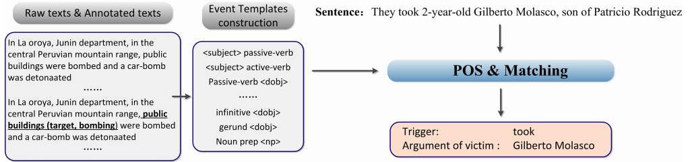

如图，事件模板从文本中提取，随后根据模板能够发现句子中出现passive-verb \<dobj\>模板，分别是took和GM这个人名。

### 2.2. 监督学习

#### 2.2.1. 机器学习

机器学习中主要存在两种事件抽取模型：管道模型和联合模型，管道模型首先进行事件触发词识别/分类,然后进行论元识别/分类。后者同时完成事件触发词识别/分类及论元识别/分类。

##### 2.2.1.1. 模型的文本特征

最常用的文本特征一般可以分为三种类型：词汇特征、句法特征和语义特征。

每个特征都可以表示为基于 词袋模型的二进制向量。特征提取是关于如何选择最重要的特征以及如何将它们整合到一个高维向量中来表示句子中的每个单词。提取的文本特征及其来自训练数据集的相应标签将用于训练事件提取分类器。

##### 2.2.1.2. Pipeline（流水线模型）

管道分类通常为一个子任务训练一组独立的分类器。 然而，一个分类器的输出也可以作为其后续分类器输入的一部分。 为了训练分类器，可以使用多种特征，根据篇幅可以分为句子中的局部特征和文档中的全局特征。因此可分为句子级的事件抽取和篇章级事件抽取。

- 句子级的事件抽取：首先将句子标记为离散的标记，然后每个标记由基于特征工程结果的特征向量表示。
- 篇章级事件抽取：对于篇章级任务，有两个关键的设计问题：可以使用什么样的全局信息；以及如何应用它们来辅助事件提取。目前来说分为几种思路：
  - 利用全局信息来构建额外的推理模型，通过评估局部分类器输出的置信度来增强局部分类器
  - 使用全局信息作为全局特征与句子级特征一起被利用来训练局部事件提取分类器

##### 2.2.1.3. Joint（联合模型）

管道分类模型可能会遇到错误传播问题，上游分类器中的错误很容易传播到下游分类器并可能降低其性能。另一方面，下游分类器不能影响其先前分类器的决策，并且不能很好地利用不同子任务的相互依赖关系。联合模型能够避免上述问题。现有的机器学习联合模型主要有以下思路：

- 在每个事件提取阶段为多个子任务训练联合分类模型
- 训练联合分类模型以根据预定义事件结构的同时提取事件的触发器和相应的论元
- 结构化预测方法，一般被用于生物医学领域的联合提取模型

#### 2.2.2. 深度学习

##### 2.2.2.1 CNN

CNN能够基于连续和广义的**词嵌入**来学习**文本隐藏特征**，因此已证明它可以有效地捕获句子的句法和语义。

Nguyen等人[1]每个单词首先被转换为一个实值向量表示，它是单词嵌入、其位置嵌入和实体类型嵌入的串联，作为网络输入。 CNN 从输入到输出由一个卷积层、一个最大池化层和一个 softmax 层组成，并输出每个单词的分类结果。如图所示。

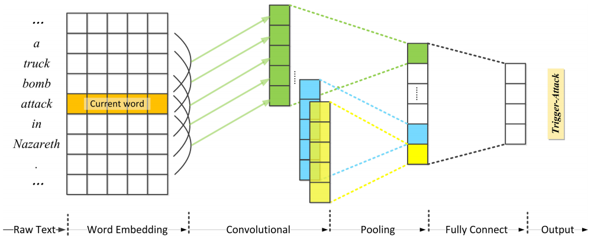

Chen等人提出了一种动态多池卷积神经网络（DMCNN）[2]，通过动态多池层提取词汇级别和句子级别的特征来评估句子的每个组成部分，每个特征图根据预测的触发词分为三个部分，保留每个部分的最大值，以保留更有价值的信息。

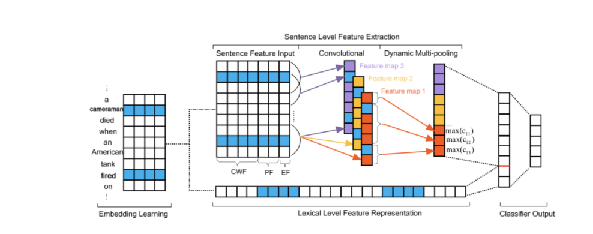

- 输入层（特征）
  DMCNN输入层包括了三种类型的特征：CWF、PF、EF，分别代表了词嵌入、位置嵌入以及事件类型嵌入。三个嵌入拼接的结果作为一个词的词级别特征。

  这里的位置嵌入实际表达的是每个词相对于触发词以及候选论元的位置，事件类型即触发词的类型。

- 卷积+分段（动态）池化

  传统的池化（无论是Max Pooling还是Average Pooling）最终一个featureMap都只有一个结果。分段池化就是对卷积的结果分块，每块单独池化，最终分了3段就有3个值。如上图所示，分段的切分点分别是触发词和候选论元。这样无论是触发词同候选论元不同，触发词不同而候选论元相同、还是触发词不同且候选论元同…最终获得的句子级语义特征都不同了。

##### 2.2.2.2 RNN(recurrent neural network)

CNN不能很好地捕捉到遥远词之间的一些潜在相互依赖关系，以利用整个句子来联合提取触发词和论元。

RNN 由一系列连接的长短期记忆 (LSTM) 神经元组成，其中 LSTM 神经元的输出也用作其顺序连接的 LSTM 神经元的输入。利用任何两个直接或间接连接的单词之间的潜在依赖关系来完成抽取任务。

Nguyen 等人[3]设计了一种用于联合事件提取的双向RNN架构，通过两个单独的RNN在正向和反向两个方向上运行，每个RNN由一系列门控循环单元(GRU)组成。

Sha等人[4]设计了dbRNN（依赖桥RNN），将两个RNN神经元之间的句法依赖连接添加到双向RNN中。

对于中文的抽取任务，Lixiang Guo等人[5]使用BiLSTM-CRF模型提取了中文的紧急事件。

**2.2.2.3 GNN(graph neural network)**

GNN是图结构上运行的多个神经元，在非欧几里得空间中实现几何深度学习。 传统的神经元操作，如在 RNN 和 CNN 中广泛使用的循环核和卷积核，也可以应用在图结构中，以学习嵌入在图内的各种深层特征，以用于不同的任务。

在事件抽取领域中，这种方法的核心问题是为文本中的单词构建一个图。

Rao等人[6]采用了一种语义分析技术，称为抽象意义表示（AMR），它可以规范化文本中的许多词汇和句法变化，并输出一个有向无环图来捕捉“谁对谁做了什么”的概念在文本中。此外，提出事件结构是 AMR 图的子图，并将事件提取任务视为子图识别问题。他们训练了一个图 LSTM 模型来识别这样一个用于生物医学事件提取的事件子图。

##### 2.2.2.4 基于注意力机制的模型

基于 RNN 和基于 CNN 的模型不能完全模拟事件之间的关联。通过控制句子各部分不同的权重信息，注意力机制使模型关注句子的重要特征信息而忽略其他不重要的特征信息，合理分配资源以提取更准确的结果。同时，注意力机制本身可以作为一种对齐，解释端到端模型中输入和输出的对齐，使模型更具可解释性。

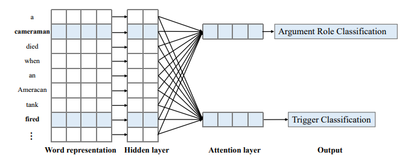

联合多事件提取（JMEE）[7]由四个模块组成：词表示、句法图卷积网络、自注意力触发分类和参数分类模块。 通过引入语法捷径弧来增强信息流。 基于注意力的图卷积网络用于联合建模图信息以提取多个事件触发器和参数。 此外，当联合提取事件触发器和参数以解决数据集不平衡时，它优化了有偏的损失函数。

##### 2.2.2.5 基于Transformer的模型

######  TextToEvent：

**题目：**Text2Event: Controllable Sequence-to-Structure Generation for End-to-end Event Extraction[8]

**作者：**Yaojie Lu, Hongyu Lin, Jin Xu, Xianpei Han, Jialong Tang, Annan Li, Le Sun, Meng Liao, Shaoyi Chen

设计了一个序列到结构(sequence to structure)的事件提取方式，端到端的直接从文本中提取事件，为整个事件抽取过程统一构建模型。

1. 事件结构的生成

   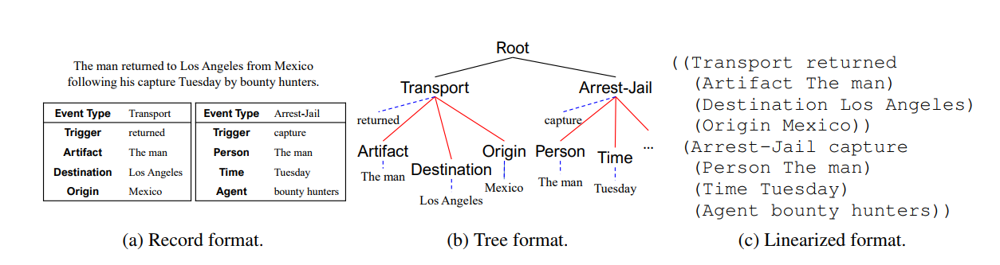

   如上图所示，对于(a)中事件结构，生成树状事件结构，root指向不同的事件，事件类型通过蓝色虚线指向触发词，通过红色线指向相应论元类型，论元类型通过蓝色虚线指向具体论元内容。根据树状结构生成线性结构，黑线和红线来说没加深一层，用（）包裹起来，对于蓝色虚线，则和其父节点同在一个（）内

2. 模型架构

   基于transformer的编码器-解码器架构来生成结构化事件。

   1. 首先通过多层transformer编码器计算隐藏的向量表示H，每层为多头注意力机制的transformer块。
   2. 通过多层transformer解码器预测输出的事件结构。每一步（第i步）生成线性结构的token yi，和解码状态hid。每层transformer块中包含基于解码状态自注意力机制和基于编码状态H的交叉注意力机制。

   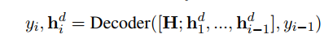

   - 解码算法：基于trie的约束解码，在约束解码期间，事件模式知识作为解码器的提示被注入，并确保生成有效的事件结构。

     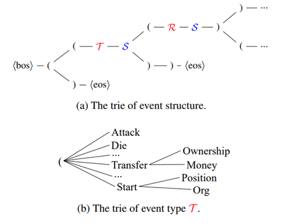

     当前事件结构的trie结构如图中(a)，比如在"\<bos>("后面的候选词汇表为{ "(", ")" }，图中(b)展示了T的内部结构。

     - 根据当前生成的状态动态选择和修剪候选词汇表 V。
     - 三类候选词汇：
       1. 事件模式：事件类型 T 和论元角色 R 的标签名称；
       2. 提及字符串：事件触发词和论元提及 S，它是输入的原始文本；
       3. 结构指示符：“(”和“)”，用于组合事件模式的字符串。

3. 生成的结构化序列，以\<bos>开始，\<eos>结束，输出序列的条件概率是组合每一步的概率计算的。每一步的概率是通过对于目标词表V进行softmax归一化后的概率。

   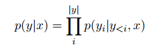

##  3.特殊事件抽取场景

### 3.1 Document-level事件抽取:

不同于句子级别的事件抽取，Document-level Event Extraction(DEE)有两大挑战

- Arguments-scattering（论元分散于文档）：一个事件的论元可能出现在文档的多个句子之中，无法从一个句子中提取完整事件结构。
- Multi-events（多事件）：一个文档可能包含多个事件，需要处理事件间的依赖关系。

3.1.1 基于Doc2EDAG论文中中文财务公告数据集的DEE：

| 论文名                                                       | 作者                                                         | 年份 | 模型结构                                                     | 单事件数据集F1 | 多事件数据集F1 | 单+多数据集F1 | url                                              | code                                                   |
| ------------------------------------------------------------ | ------------------------------------------------------------ | ---- | ------------------------------------------------------------ | -------------- | -------------- | ------------- | ------------------------------------------------ | ------------------------------------------------------ |
| Doc2EDAG: An End-to-End Document-level Framework for Chinese Financial Event Extraction | Shun Zheng, Wei Cao, Wei Xu, Jiang Bian                      | 2019 |                                                              | 82.3           | 67.3           | 76.3          | https://www.aclweb.org/anthology/D19-1032/       | https://github.com/dolphin-zs/Doc2EDAG/tree/master/dee |
| Document-level Event Extraction via Heterogeneous Graph-based Interaction Model with a Tracker | Runxin Xu, Tianyu Liu, Lei Li, Baobao Chang                  | 2021 | 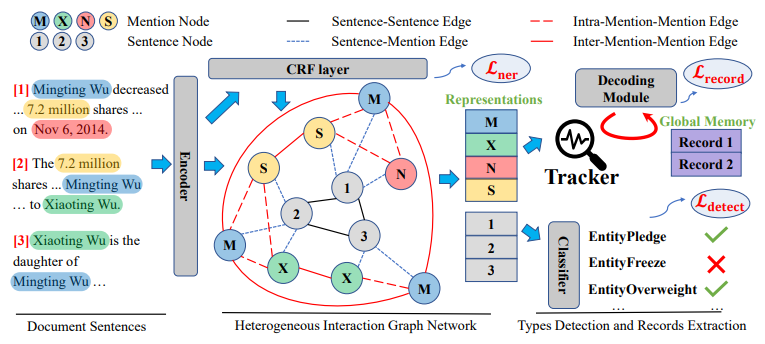 | 87.6           | 72.3           | 80.3          | https://arxiv.org/abs/2105.14924                 | https://github.com/RunxinXu/GIT                        |
| Document-level Event Extraction via Parallel Prediction Networks | Hang Yang , Dianbo Sui, Yubo Chen, Kang Liu, Jun Zhao, Taifeng Wang | 2021 | 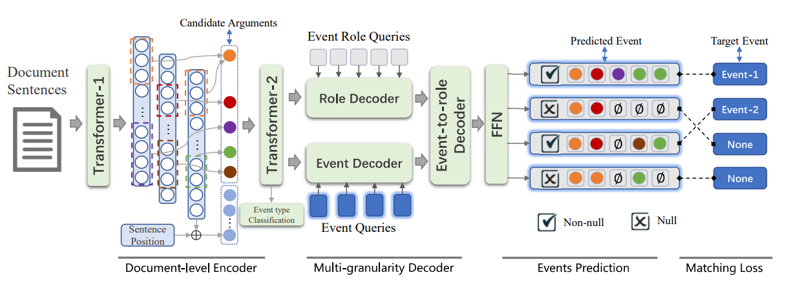 | 83.9           | 68.7           | 77.9          | https://aclanthology.org/2021.acl-long.492/      | https://github.com/hangyang-nlp/de-ppn                 |
| Exploring  Sentence Community for  Document-Level  Event Extraction | Yusheng  Huang, Weijia  Jia                                  | 2021 | 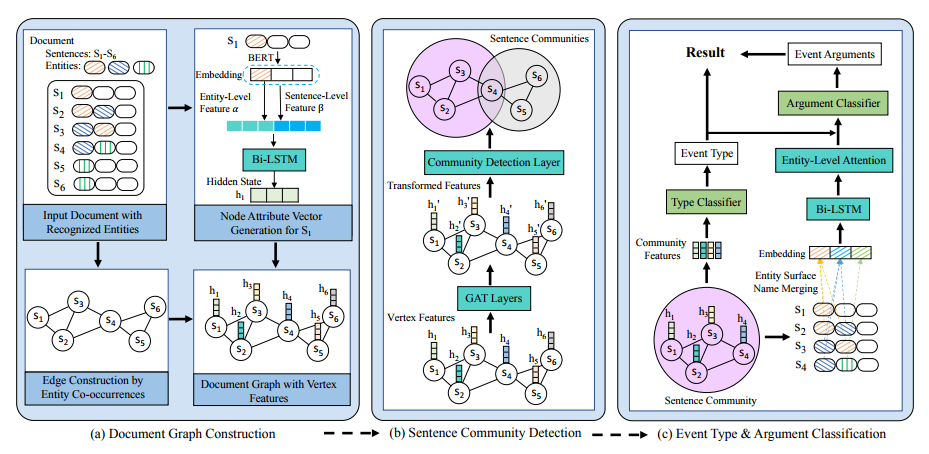 | -              | -              | 78.9          | https://aclanthology.org/2021.findings-emnlp.32/ |                                                        |

### 3.2 Few-Shot/Zero-Shot：

由于数据的标注成本昂贵，通常存在标注数据不足以完成完全监督学习任务的情况。本节展示在少样本/无样本情况下的研究。

### 4.参考文献

[1] [Event detection and domain adaptation with convolutional neural networks](https://aclanthology.org/P15-2060.pdf)

[2] [Event extraction via dynamic multipooling convolutional neural networks](https://aclanthology.org/P15-1017.pdf)

[3] [Joint event extraction via recurrent neural networks](https://aclanthology.org/N16-1034.pdf)

[4] [Jointly extracting event triggers and arguments by dependency-bridge RNN and tensor-based argument interaction](https://ojs.aaai.org/index.php/AAAI/article/view/12034)

[5] [A Practical Approach to Chinese Emergency Event Extraction using BiLSTM-CRF](https://ieeexplore.ieee.org/abstract/document/8802663/)

[6] [Biomedical event extraction using abstract meaning representation](https://aclanthology.org/W17-2315/)

[7] [Jointly multiple events extraction via attention-based graph information aggregation](https://arxiv.org/abs/1809.09078)

[8] [Text2event: Controllable sequence-to-structure generation for end-to-end event extraction](https://arxiv.org/abs/2106.09232)