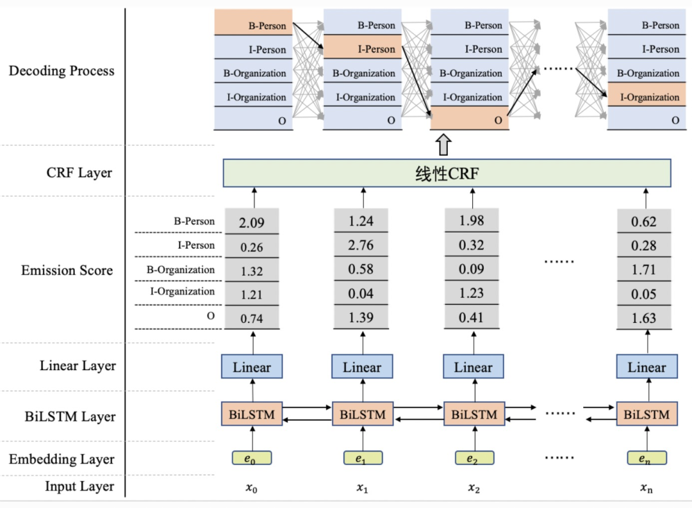
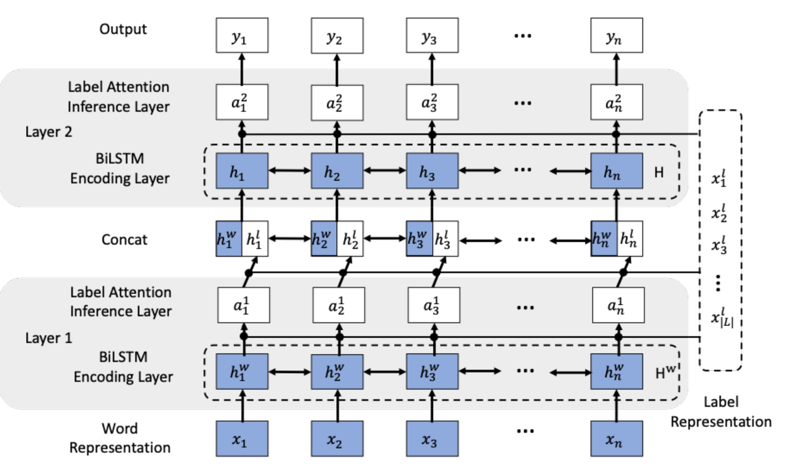
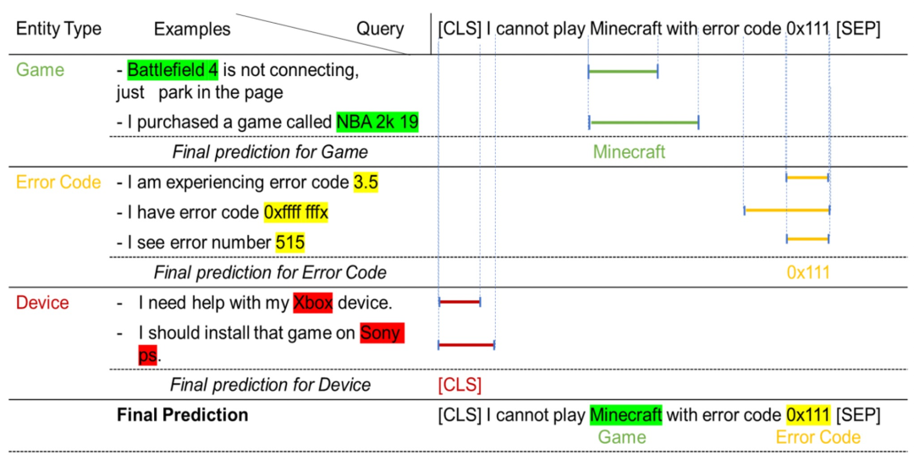
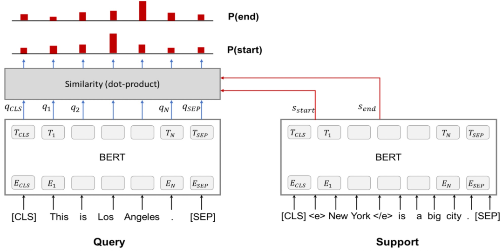
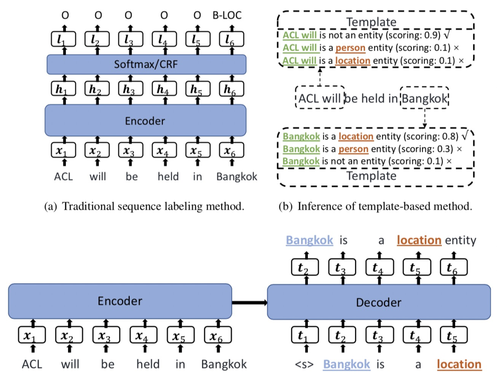
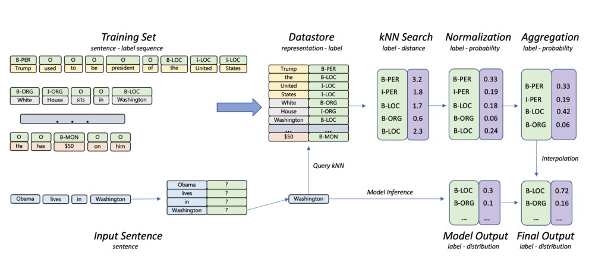
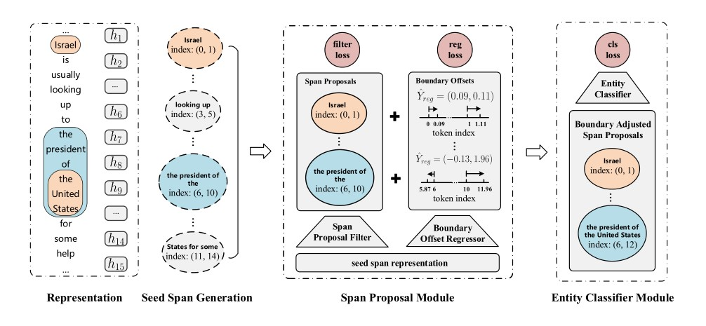
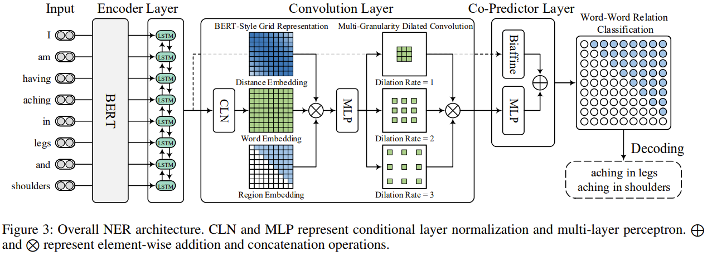

# 命名实体识别调研

[TOC]

## 1.任务

### 1.1 背景

​		1991年Rau等学者首次提出了命名实体识别任务,随后自1996年开始,命名实体识别任务被加入到信息抽取领域。命名实体（Named Entity）是一类短语或者单词，能够在文本集合中识别出与自身具有相似属性的实体（mention）。在通用领域，命名实体可以是人名、地名、组织名；在一些垂直领域，命名实体可以根据具体任务，人为规定划分。命名实体识别（NER）不仅在信息抽取（information extration）领域的独立任务，而且在信息检索（information retrieval）、问答（question answering）、机器翻译（machine translation）等自然语言处理任务中起到重要的预处理作用。

### 1.2 任务定义

​		命名实体识别（NER）是一类对文本中的实体按照预先定义的实体范畴定位和划分的任务。

### 1.3 数据集

| Corpus        | URL                                                          |
| ------------- | ------------------------------------------------------------ |
| CoNLL2002     | https://www.clips.uantwerpen.be/conll2002/ner/               |
| CoNLL2003     | https://www.clips.uantwerpen.be/conll2003/ner/               |
| OntoNotes 5.0 | https://catalog.ldc.upenn.edu/LDC2013T19                     |
| MSRANER       | https://github.com/lemonhu/NER-BERT-pytorch/tree/master/data/msra |
| CLUENER       | https://storage.googleapis.com/cluebenchmark/tasks/cluener_public.zip |
| WeiboNER      | https://github.com/hltcoe/golden-horse                       |
| Resume NER    | https://github.com/jiesutd/LatticeLSTM                       |
| Boson         | https://github.com/TomatoTang/BILSTM-CRF                     |
| 人民日报ner   | https://github.com/ThunderingII/nlp_ner/tree/master/data     |
| ACE2005       | https://catalog.ldc.upenn.edu/LDC2006T06                     |

**CoNLL2002**

 - 该数据集分为西班牙语和荷兰语两种，每种语言版本包括三个文件：一个训练数据集，两个测试数据集testa及testb。
 - 包括四类实体：person names(PER) 、organizations(ORG)、location(LOC)、 miscellaneous names (MISC)
 - 数据主要来自于新闻领域，按照每个token及其label用空格隔开占据一行的方式存储。

**CoNLL2003**

- 该数据集分为英语和德语两种，每种语言版本包括三个文件：一个训练数据集，两个测试集。
- 包括四类实体：persons, locations, organizations、miscellaneous
- 数据集有四列，一次表示token，词性，词块、label

**OntoNotes 5.0**

- 该数据集是该系列数据集的汇总，包括Arabic、English、Chinese三种语言版本。

**MSRANER**

- MSRANER是由微软亚洲研究院标注的新闻领域的实体识别数据集，也是SIGNAN backoff 2006的实体识别任务的数据集之一。
- 该数据集包含5 万多条中文实体识别标注数据 ，实体类别分为人物、地点、机构三类。

**CLUENER**

- 数据分为10个标签类别，分别为: 地址（address），书名（book），公司（company），游戏（game），政府（government），电影（movie），姓名（name），组织机构（organization），职位（position），景点（scene）
- 细粒度命名实体识别数据集
- 本数据是在清华大学开源的文本分类数据集THUCTC基础上，选出部分数据进行细粒度命名实体标注，原数据来源于Sina News RSS.

**WeiboNER**

- WeiboNER是根据新浪微博2013年11月至2014年12月间历史数据筛选过滤生成，包含1890条微博消息，基于LDC2014的DEFT ERE的标注标准
  进行标注。该数据集实体类别分为人物，机构组织，地址和地缘政治实体4个类别，并且每个类别可细分为特指（NAM，如“张三”标签为“PER.NAM”）和泛指（NOM，如“男人”标签为“PER.NOM”）。

**Resume NER**

- Resume NER是根据新浪财经网关于上市公司的高级经理人的简历摘要数据，进行筛选过滤和人工标注生成的。该数据集包含1027份简历摘要，实体标注分为人名、国籍、籍贯、种族、专业、学位、机构、职称等8个类别。

**Boson**

- 由玻森中文语义开放平台提供，共2000句。
- 它采用了双花括号的方式标注，实体类别共6种：time: 时间 location: 地点 person_name: 人名 org_name: 组织名 company_name: 公司名 product_name: 产品名。

**人民日报**

- 包括1998和2014两个版本
- 1998版本提供了大概2.3万个句子，取材于人民日报的正式新闻体语料。
- 2014年更新更全的一版人民日报语料。分成两个数据文件，前一个是分词后的原文本，后一个是分词后一一对应的标签，总共大概28.6万个句子。

**ACE2005**

- ACE 2005多语种培训语料库包含完整的英语、阿拉伯语和汉语训练数据，用于2005年自动内容提取(ACE)技术评估。语料库由多种类型的数据组成包括实体、关系和事件.

### 1.4 NER工具

| Name            | URL                                    |
| --------------- | -------------------------------------- |
| StanfordCoreNLP | https://stanfordnlp.github.io/CoreNLP/ |
| OSU Twitter NLP | https://github.com/aritter/twitter_nlp |
| Illinois NLP    | http://cogcomp.org/page/software/      |
| NeuroNER        | http://neuroner.com/                   |
| NERsuite        | http://nersuite.nlplab.org/            |
| Polyglot        | https://polyglot.readthedocs.io        |
| Gimli           | http://bioinformatics.ua.pt/gimli      |

​		介绍几个专门面向中文的命名实体识别的工具,目前较为成熟的中文命名实体识别（NER）工具包括LTP，Hanlp，BosonNLP等。

|   Name   | description                                                  | url                               |
| :------: | ------------------------------------------------------------ | --------------------------------- |
|   LTP    | 语言技术平台(LTP) 是哈工大社会计算与信息检索研究中心 11 年的持续研发和推广，LTP 已经成为国内外最具影响力的中文处理基础平台，LTP提供包括中文分词、词性标注、命名实体识别、依存句法分析、语义角色标注等丰富、高效、精准的自然语言处理技术。 | http://ltp.ai/                    |
|  Hanlp   | HanLP是一系列模型与算法组成的NLP工具包，目标是普及自然语言处理在生产环境中的应用。HanLP具备功能完善、性能高效、架构清晰、语料时新、可自定义的特点。内部算法经过工业界和学术界考验。目前，基于深度学习的HanLP 2.0正处于alpha测试阶段，未来将实现知识图谱、问答系统、自动摘要、文本语义相似度、指代消解、三元组抽取、实体链接等功能。 | https://github.com/hankcs/pyhanlp |
| BosonNLP | BosonNLP实体识别引擎基于自主研发的结构化信息抽取算法，F1分数达到81%，相比于StanfordNER高出7个百分点。通过对行业语料的进一步学习，可以达到更高的准确率。 | http://static.bosonnlp.com/       |

### 1.5 标注方式

​		NER任务的标签标注有多个体系，按照序列标注的方法，可以采用BIO、BIOES、BILOU等方式对每一个token进行标注。在BIO标注法，B代表实体首部、I表示实体中间和结尾的实体token、O代表非实体token,采用X-TYPE描述实体的类别。BIOES和BILOU和BIO类似S和U表示用一个token单独表示的实体，用E和L表示实体的结尾，这两种标注方式的粒度更细，对实体边界的描述更加具体，在实际情况中，训练效果更好，但标注成本会更高。

### 1.6 评测标准

​			NER任务包括两个判断标注：实体边界和实体类型。这两个都正确的即为正确的识别。通常来说，对于NER模型预测到的实体但不是正确的实体记为FP(False Positive) 、NER未能正确返回的实体记为FN(False Negative)、NER正确预测的实体即为TP(True Positive)。

​		NER模型将精确度（Precision）、召回率（Recall）和F-score作为评测的标准，其定义如下：

​           P =  TP / (TP + FP)

​		   R = TP / (TP + FN)

​		   F = 2 * P * R / (P + R)  

​		在NER任务评价中，一般使用实体级别的评测标准，即将一个实体的边界和类别都预测正确是为一个TP,; 在使用字符级别的评测时， 将其看作序列标注任务。

### 1.7 SOTA

  **CoNLL2003**

| F1    | 论文题目                                                     | 论文链接                               | 年份     | Code                            |
| ----- | ------------------------------------------------------------ | -------------------------------------- | -------- | ------------------------------- |
| 93.07 | Unified Named Entity Recognition as Word-Word Relation Classification | https://arxiv.org/pdf/2112.10070v1.pdf | AAAI2022 | https://github.com/ljynlp/W2NER |
|       |                                                              |                                        |          |                                 |

**OntoNotes 5.0**

| F1    | 论文题目                                                     | 论文链接                               | 年份     | Code                            |
| ----- | ------------------------------------------------------------ | -------------------------------------- | -------- | ------------------------------- |
| 90.50 | Unified Named Entity Recognition as Word-Word Relation Classification | https://arxiv.org/pdf/2112.10070v1.pdf | AAAI2022 | https://github.com/ljynlp/W2NER |
|       |                                                              |                                        |          |                                 |

**MSRA**

| F1    | 论文题目                                                     | 论文链接                               | 年份     | Code                            |
| ----- | ------------------------------------------------------------ | -------------------------------------- | -------- | ------------------------------- |
| 96.10 | Unified Named Entity Recognition as Word-Word Relation Classification | https://arxiv.org/pdf/2112.10070v1.pdf | AAAI2022 | https://github.com/ljynlp/W2NER |
|       |                                                              |                                        |          |                                 |

**Weibo**

| F1    | 论文题目                                                     | 论文链接                               | 年份     | Code                            |
| ----- | ------------------------------------------------------------ | -------------------------------------- | -------- | ------------------------------- |
| 72.32 | Unified Named Entity Recognition as Word-Word Relation Classification | https://arxiv.org/pdf/2112.10070v1.pdf | AAAI2022 | https://github.com/ljynlp/W2NER |
|       |                                                              |                                        |          |                                 |

**Resume**

| F1    | 论文题目                                                     | 论文链接                               | 年份     | Code                            |
| ----- | ------------------------------------------------------------ | -------------------------------------- | -------- | ------------------------------- |
| 96.65 | Unified Named Entity Recognition as Word-Word Relation Classification | https://arxiv.org/pdf/2112.10070v1.pdf | AAAI2022 | https://github.com/ljynlp/W2NER |
|       |                                                              |                                        |          |                                 |

**ACE2005**

| F1    | 论文题目                                                     | 论文链接                               | 年份     | Code                                         |
| ----- | ------------------------------------------------------------ | -------------------------------------- | -------- | -------------------------------------------- |
| 86.79 | Unified Named Entity Recognition as Word-Word Relation Classification | https://arxiv.org/pdf/2112.10070v1.pdf | AAAI2022 | https://github.com/ljynlp/W2NER              |
| 86.91 | Nested Named Entity Recognition as Latent Lexicalized Constituency Parsing | https://arxiv.org/pdf/2203.04665.pdf   | ACL2022  | https://github.com/LouChao98/nner_as_parsing |
|       |                                                              |                                        |          |                                              |

## 2.方法总结

###  2.1 基于规则的方法（Rule-based approaches）

​		基于规则的方法多采用语言学专家手工构造规则模板，选用特征包括统计信息、标点符号、关键字、指示词和方向词、位置词(如尾字)、中心词等方法，以模式和字符串相匹配为主要手段，这类系统大多依赖于知识库和词典的建立。基于规则和词典的方法是命名实体识别中最早使用的方法，它们依赖于手工规则的系统，都使用命名实体库，而且对每一个规则都赋予权值。当遇到规则冲突的时候，选择权值最高的规则来判别命名实体的类型。一般而言，当提取的规则能比较精确地反映语言现象时，基于规则的方法性能要优于基于统计的方法。但基于规则和字典的方法也有其缺陷：

- 规则往往依赖于具体语言、领域和文本风格，制定规则的过程耗时且难以涵盖所有的语言，特别容易产生错误，系统可移植性差，对于不同的系统需要语言学专家重新书写规则。
- 代价太大，存在系统建设周期长、需要建立不同领域知识库作为辅助以提高系统识别能力等问题。

​		一些知名的基于规则的NER系统包括LaSIE-II、NetOwl、Facile、SAR、LTG等，这些系统都是基于人工规则的语法语义规则。

### 2.2  无监督学习方法（Unsupervised learning approaches）

​		无监督学习方法通常采用无监督算法，并且不需要标注训练集进行学习。一个典型的无监督学习方法是聚类算法（clustering）。采用聚类算法的NER模型根据上下文的相似度进行聚簇的实体抽取。其关键步骤是根据词汇资源、词汇模式和语料库上的计算统计数据来推断命名实体的mention。

### 2.3  基于特征的监督学习方法（Feature-based supervised learning approaches）

​		采用监督学习的方法，NER任务可以被看做是多分类的序列标注问题，根据标注的数据样本特征，使用机器学习算法训练模型并使用此模型识别未遇到的数据中的实体及类别。与分类问题相比,序列标注问题中当前的预测标签不仅与当前的输入特征相关,还与之前的预测标签相关,即预测标签序列之间是有强相互依赖关系的。

​	    在监督学习NER模型中，特征工程至关重要，在NER系统中，大多数采用句子级、单词级和字符集的的分布式向量表示。基于这些特征，许多机器学习算法可以在监督学习中被使用，包括隐马尔可夫模型（Hidden Markov Models, HMM）、决策树算法（Decision Tree）、最大熵模型（Maximum Entropy Models, ME）、支持向量机（Support Vector Machine, SVM）条件随机场（Conditional Random Fields, CRF）等。

​		在上述的机器学习模型中，ME结构紧凑,具有较好的通用性,其主要缺点是训练时间复杂性非常高,甚至导致训练代价难以承受,另外由于需要明确的归一化计算,导致开销比较大;HMM属于生成模型，对转移概率和发射概率进行联合概率建模，统计共现概率,训练和推理时的速度较快一些；CRF模型统计全局概率,在归一化时考虑数据在全局的分布,而不是仅仅在局部进行归一化,因此解决了标记偏置的问题,在传统机器学习中,CRF被看作是命名实体识别的主流模型,优点在于在对一个位置进行标注的过程中CRF可以利用内部及上下文特征信息。

[HMM]

[CRF]

### 2.4 基于深度学习的方法（Deep-learning based approaches）

​		相比于基于特征的方法，深度学习的优势在于能自动地发现隐藏特征，并训练一个端到端的NER模型，这使得人工构造的特征工程的没有那么重要，可以设计一些复杂的NER模型。一般地，基于深度学习地NER任务可以拆分为3个部分：输入信息表示、编码、标签解码。

​		独热表示（one-hot）是最直接地单词表示方法。在不同的向量维度上取1代表不同的单词，但没有对单词间的相关性做出表示。分布式表示使用低维、实值、稠密的词向量表示单词，包含一定的潜在特征，是主流的使用对象。分布式表示一般是通过预训练模型得到，如word2vec(CBOW、skip-gram models)、GloVe、BERT等。预训练词向量包含了从大量文本数据中得到的先验知识，在后续的NLP任务中起到重要的初始化和优化作用。

​		对于词向量的表示，其来源除了预训练模型，研究者还使用字符级别、前后缀、中文中的词汇等信息通过LSTM、GRU等神经网络得到其分布式表示。通过融合多种分布式向量表示以增强词向量中的先验信息，更好的表示语义信息。通过将词向量喂入神经网络模型来进行预测，得到可能结果的向量表示。主流的神经网络包括CNN、BiLSTM、GRU和一些图神经网络。在标签解码阶段，采用softmax或者CRF。

​		解决NER问题最经典的深度学习模型结构是[1]提出的LSTM-CRF架构。单独的LSTM其实就可以完成序列标注任务，利用LSTM对输入句子进行编码，最后得到每个单词的各个分类结果的打分。但是，只用LSTM的问题是，没有办法学到输出标签之间的依赖关系。例如B-person后面经常跟着的是I-Person这种输出标签的规律，在LSTM中感知较弱。因此，一般会在LSTM后面加一个CRF层。CRF指的是我们有一个隐变量序列和一个观测序列，每个观测值只和该时刻的隐变量以及上一时刻的观测值有关。CRF的目标就是学习隐变量到观测值的发射概率，以及当前观测值和下一个观测值之间的转移概率。LSTM-CRF中，CRF建模了NER标签之间的转移关系，弥补了LSTM在这方面的不足。CRF的核心作用就是建模label之间的依赖关系。LSTM-CRF的整体结构如下图所示。

​		

​		在LSTM-CRF模型结构的基础上可以使用其他方式进行改进，例如将文本的编码器LSTM替换为Bert，或者将CRF替换成Softmax。例如[2]]采用了Bert-CRF的模型结构解决NER任务。对于CRF部分，[3]提出采用label embedding结合多层attention机制学习各个位置label之间的关系，如下图模型结构。相比CRF模型，这种方法可以建模更复杂的label之间关系。

## 3. 研究热点

​		调研近年来实体识别领域的相关工作，我们总结了几个具有代表性的研究热点，通过几篇论文进行展开介绍，包括小样本实体识别、数据增强、嵌套实体识别以及不连续实体识别。

### 3.1 小样本学习下的NER任务

​		当我们有一个领域的大量NER任务有标注样本，但是在目标领域内只有少量有标注样本时，一个提升NER效果的方法利用迁移学习技术，在源领域有大量样本的数据上预训练，再在目标域上Finetune。然而，在NER问题中，不同场景中需要预测的实体类型是不同的，这导致无法直接进行迁移。为了解决这种小样本学习下的NER任务，学术界也提出了一些相应方法。

​		[4]提出一种基于样例的NER解决方法，主要思路是利用一些有标注样本样例，识别出新数据中相关的entity。例如在下面的例子中，右侧为需要识别的句子，左侧为一些有标注样本，利用左侧的标注信息识别右侧的实体（注意左侧和右侧的实体名称都是不同的）。

​		[4]提出了一种两阶段的方法，首先利用样例找到句子中最有可能是实体的span的开始位置和结束位置，然后给这个span分配对应的实体。具体做法为，对于每一个query（即待预测实体的句子），会构造相应的support（有实体标注的句子），其中support中会对实体前后增加<e\>和<\e>这种特殊字符。通过Bert对query和support分别编码，然后计算support中\<e>和<\e>和query中每个token的匹配位置，找到query中可能为entity span的起止位置。对于一个query会有多个support句子来参考，会使用句子之间的attention加权各个support匹配的query中的起止位置，这部分的模型结构如下（即每个support和query的attention权重加权每个support和query的起止位置相似度匹配分）:

​		模型的第二部分是在第一步识别出的entity span的基础上，进一步识别这个entity span具体对应哪个entity。这一步的具体做法和第一步类似，利用support样例计算query中每个token是各个entity类型的起始和终止位置的概率。	  

​       [5]采用Prompt的思路解决小样本学习下的NER任务。原来解决NER任务的一般做法为将其视为序列标注任务，而这篇文章将其视为一个cloze prompt任务。首先，需要人工定义一个正样本模板和一个负样本模板。对于一个句子，如果某个词组是实体，那么其对应的模板就是\<xi:j> is a \<yk>；如果某个词组不是实体，那么其对应的模板为\<xi:j> is not an entity。例如对于一个输入文本ACL will be held in Bangkok来说，需要构造出多组模板文本，对应每个词组是否为某个entity，如Bangkok is a location entity。在训练阶段会根据label构造出所有是entity的模板对应的样本和非entity的模板对应的样本。在训练过程中，会把原始的文本输入到预训练好的BART Encoder中，得到原文的编码表示。同时在Decoder中，预测根据模板生成的多组文本。例如ACL will be held in Bangkok，在Decoder阶段就需要以生成利用模板产出的文本如Bangkok is a location entity为目标。这样，Decoder相当于学到了一种能力，根据原文输入，对一个模板构造的文本打分。如果Bangkok is a location entity这句话打分很大，说明这句话就是对的，那么就可以抽取出Bangkok是一个地名对应的entity。模型的结构和template例子如下图：

​		 

​		这种方法借助了Prompt的思路，很巧妙的解决了少样本情况下的NER问题，同时也能够解决zero-shot情况下的NER问题，高效利用了预训练模型。

​		近年来,在基于神经网络的结构上加入注意力机制、图神经网络、迁移学习、远监督学习等热门研究技术也是目前的主流研究方向。

### 3.2 数据增强

​			[7]中提出了一种在常规实体识别任务中的预测阶段加入KNN的方法进行检索式的数据增强。在训练阶段，按正常的序列任务训练一个常规的NER模型；在推理阶段，由常规模型预测一个分布+由kNN检索出来的一个分布，两个分布融合作为最终的预测分布，从而达到提高NER识别效果**。**换一个角度来看，论文提出的kNN-NER框架其实是一种较为简洁的集成算法，将序列模型+kNN模型预测的结果进行集成，而kNN模型在检索中可以利用序列模型形成的分布，进而在训练过程中并不需要额外的操作。

​		上图是采用KNN-NER进行处理的实例，Datastore是从普通的NER模型的隐藏层中抽取的token表示和标签对，在进行推理时，将每一时刻输入token作为query，在Datastore中按照相似距离找到KNN搜索结果，之后经过softmax与普通NER模型预测结果进行相加得到数据增强后的结果。

### 3.3 嵌套实体及不连续实体处理

​		通常要处理的命名实体是非嵌套实体,但是在实际应用中,嵌套实体非常多。大多数命名实体识别会忽略嵌套实体,无法在深层次文本理解中捕获更细粒度的语义信息。如图3所示,在 “3月3日,中国驻爱尔兰使馆提醒旅爱中国公民重视防控,稳妥合理加强防范。” 句子中提到的中国驻爱尔兰使馆是一个嵌套实体,中国和爱尔兰均为地名,而中国驻爱尔兰使馆为组织机构名。普通的命名实体识别任务只会识别出其中的地名“中国”和“爱尔兰”,而忽略了整体的组织机构名。

​		针对嵌套实体识别问题，最容易想到的方式就是对全部的句子片段进行分类，但是存在一系列的问题，包括高计算复杂的，忽视实体边界信息以及匹配实体的片段的利用度低等问题。

​		针对上述问题，[8]提出了一个两阶段的处理嵌套实体识别的方法，通过过滤的方式产生span候选集，并且通过边际回归的方式在span候选集上定位实体。因此第一阶段低质量的spans能够被过滤掉，降低了计算消耗。就是filters+regressor，先用过滤组件划分seed spans为contextual spans和span proposals，从而减少了candidate spans；然后回归组件通过调整span boundaries定位实体，从而提升了候选spans的质量。伴随对应的类别来通过边际调整对span候选集进行标记。利用分类器去对span proposals做一个分类。

​		在[6]中，针对实体嵌套和实体不连续问题，提出了一个统一建模的W2ner模型，通过词对之间关系的判断来定义实体边界和类型。定义相邻词NNW和头尾词THW-*表示mention的头尾及类别，以二维网格的形式表示词对关系，增加Multi-Granularity Dilated Convolution及Biaffine等机制进行效果增强。

## 4. 论文列表

|                           论文题目                           |      关键词       |                     论文链接                     |   年份    |                             code                             |
| :----------------------------------------------------------: | :---------------: | :----------------------------------------------: | :-------: | :----------------------------------------------------------: |
| An Empirical Study on Multiple Information Sources for Zero-Shot Fine-Grained Entity Typing |   Fine-Grained    | https://aclanthology.org/2021.emnlp-main.210.pdf | EMNLP2021 |                                                              |
|      Fine-grained Entity Typing without Knowledge Base       |   Fine-grained    | https://aclanthology.org/2021.emnlp-main.431.pdf | EMNLP2021 |                                                              |
|        Fine-grained Entity Typing via Label Reasoning        |   Fine-grained    | https://aclanthology.org/2021.emnlp-main.378.pdf |   EMNLP   |     https://github.com/loriqing/Label-Reasoning-Network      |
| Unsupervised Paraphrasing Consistency Training for Low Resource Named Entity Recognition |   Unsupervised    |                                                  | EMNLP2021 |                                                              |
| Data Augmentation for Cross-Domain Named Entity Recognition  | data augmentation |       https://arxiv.org/pdf/2109.01758.pdf       | EMNLP2021 |            https://github.com/RiTUAL-UH/style_NER            |
| Few-Shot Named Entity Recognition: An Empirical Baseline Study |     few-shot      |                                                  | EMNLP2021 |                                                              |
| Nested Named Entity Recognition as Latent Lexicalized Constituency Parsing |    nested-NER     |       https://arxiv.org/pdf/2203.04665.pdf       |  ACL2022  |         https://github.com/LouChao98/nner_as_parsing         |
| Few-shot Named Entity Recognition with Self-describing Networks |     few-shot      |       https://arxiv.org/pdf/2203.12252.pdf       |  ACL2022  |             https://github.com/chen700564/sdnet              |
| CONTaiNER: Few-Shot Named Entity Recognition via Contrastive Learning |     few-shot      |       https://arxiv.org/pdf/2109.07589.pdf       |  ACL2022  |           https://github.com/psunlpgroup/CONTaiNER           |
| MELM: Data Augmentation with Masked Entity Language Modeling for Low-Resource NER. | data augmentation |       https://arxiv.org/pdf/2108.13655.pdf       |  ACL2022  |            https://github.com/RandyZhouRan/MELM/             |
| Bottom-Up Constituency Parsing and Nested Named Entity Recognition with Pointer Networks. |    nested-NER     |         https://arxiv.org/abs/2110.05419         |  ACL2022  |    https://github.com/sustcsonglin/pointer-net-for-nested    |
| An Unsupervised Multiple-Task and Multiple-Teacher Model for Cross-lingual Named Entity Recognition |   Unsupervised    |                                                  |  ACL2022  |                                                              |
|      Bidirectional LSTM-CRF models for sequence tagging      |    BiLSTM CRF     |       https://arxiv.org/pdf/1508.01991.pdf       |   2015    |                                                              |
| Souza F ,  Nogueira R ,  Lotufo R . Portuguese Named Entity Recognition using BERT-CRF |     BERT CRF      |      https://arxiv.org/pdf/1909.10649v2.pdf      |   2019    | https://gist.github.com/fabiocapsouza/62c98576d1c826894be2b3ae0993ef53 |
| Hierarchically-Refined Label Attention Network for Sequence Labeling | BiLSTM attention  |      https://aclanthology.org/D19-1422.pdf       | EMNLP2019 |            https://github.com/Nealcly/BiLSTM-LAN             |
|            Example-Based Named Entity Recognition            |     few-shot      |       https://arxiv.org/pdf/2008.10570.pdf       |   2020    |                                                              |
| A Span-Based Model for Joint Overlapped and Discontinuous Named Entity Recognition |       span        |  https://aclanthology.org/2021.acl-long.372.pdf  |  ACL2021  |              https://github.com/foxlf823/sodner              |
|      Template-Based Named Entity Recognition Using BART      |     few-shot      |       https://arxiv.org/pdf/2106.01760.pdf       |  ACL2021  |            https://github.com/Nealcly/templateNER            |
| Unified Named Entity Recognition as Word-Word Relation Classification |       W2NER       |      https://arxiv.org/pdf/2112.10070v1.pdf      | AAAI2022  |               https://github.com/ljynlp/W2NER                |
| kNN-NER: Named Entity Recognition with Nearest Neighbor Search |        KNN        |       https://arxiv.org/pdf/2203.17103.pdf       |   2022    |             https://github.com/ShannonAI/KNN-NER             |
| Locate and Label: A Two-stage Identifier for Nested Named Entity Recognition |    nested-NER     |       https://arxiv.org/pdf/2105.06804.pdf       |  ACL2021  | https://github.com/tricktreat/locate-and-label#requirements  |

## 5. 参考资料

- [1] Huang Z ,  Wei X ,  Kai Y . Bidirectional LSTM-CRF Models for Sequence Tagging[J]. Computer Science, 2015.
- [2] Souza F ,  Nogueira R ,  Lotufo R . Portuguese Named Entity Recognition using BERT-CRF[J].  2019.
- [3] Hierarchically-Refined Label Attention Network for Sequence Labeling（2019）.
- [4] Example-Based Named Entity Recognition.
- [5] Template-Based Named Entity Recognition Using BART
- [6] Unified Named Entity Recognition as Word-Word Relation Classification
- [7] kNN-NER: Named Entity Recognition with Nearest Neighbor Search
- [8] Locate and Label: A Two-stage Identifier for Nested Named Entity Recognition
- [9] BERT: Pre-training of Deep Bidirectional Transformers for Language Understanding

- [10] Hierarchically-Refined Label Attention Network for Sequence Labeling
- [11] CLUENER2020: FINE-GRAINED NAMED ENTITY RECOGNITION DATA S E T A N D BENCHMARK FOR CHINESE

- [12] MECT: Multi-Metadata Embedding based Cross-Transformer for Chinese Named Entity Recognition
- [13] Neural Architectures for Named Entity Recognition
- [14] Nested Named Entity Recognition Revisited
- [15] Multi-modal Graph Fusion for Named Entity Recognition with Targeted Visual Guidance
- [16] An Encoding Strategy Based Word-Character LSTM for Chinese NER
- [17] A Neural Multi-digraph Model for Chinese NER with Gazetteers
- [18] Simplify the Usage of Lexicon in Chinese NER
- [19] A Lexicon-Based Graph Neural Network for Chinese NER
- [20] CNN-Based Chinese NER with Lexicon Rethinking
- [21] Chinese NER Using Lattice LSTM
- [22] FLAT: Chinese NER Using Flat-Lattice Transformer
- [23] An Encoding Strategy Based Word-Character LSTM for Chinese NER

